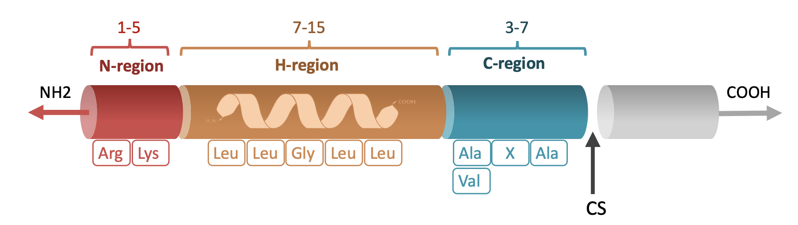
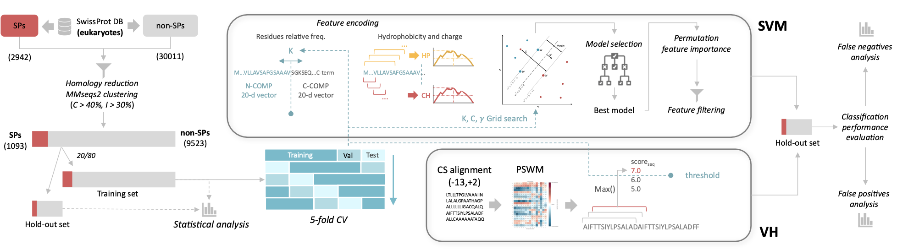

# Signal peptide prediction in eukaryotes: a comparison of SVM with a PSWM-based method

Comparing Support Vector Machines (machine learning) and Position-specific Weight Matrix  (statistical) methods for predicting Signal Peptides in eukaryotic Proteins Sequences. Hyperparameter optimization was performed using GridSearch Cross-Validation, and Feature Importance analysis identified key predictive features.

-> **[Full report PDF](./Report.pdf)**

## Overview
Signal peptides (SPs) are short peptides located at the N-terminus of proteins, carrying information for protein
secretion. SPs gained attention in several scientific and industrial applications, including recombinant protein production and immunization. Therefore, since the dawn of bioinformatics, the prediction of signal peptides and protein subcellular location has been one of the main focal points. In this work two different sequence-based methods for eukaryotes SP proteins classification were implemented. A support vector machine (SVM) classifier trained with a combination of features describing residue composition and local hydrophobicity. The position-specific weight matrix (PSWM) method based on von Heijne (VH) method was implemented for comparison.

**Aim**: This project aimed to compare the performance of two sequence-based methods, Support Vector Machine (SVM) and Position-Specific Weight Matrix (PSWM), for predicting signal peptides (SPs) in eukaryotic proteins (binary classification).

**Methods**: Eukaryotic protein sequences were collected from UniProtKB/SwissProt. Both SVM (using features like residue composition and hydrophobicity) and PSWM models were trained and optimized using 5-fold GridSearchCV and benchmarked on a hold-out test set.

**Results**: The SVM method significantly outperformed the PSWM method in predicting signal peptides. SVM achieved a Matthews Correlation Coefficient (MCC) of 0.89 and a false positive rate (FPR) of 0.9%, compared to an MCC of 0.68 and FPR of 3.4% for PSWM, demonstrating the superior accuracy of the machine learning approach.

***Disclaimer**: This project was developed as part of the Master's degree course Laboratory of Bioinformatics 2 (Univerisity of Bologna). This project  highlights the practical application of classical machine learning and statistical methods, providing a foundational understanding of the challenges and opportunities in sequence-based classification tasks.It is important to note that the objective was not to produce a state-of-the-art predictor but to gain hands-on experience in designing, training, and benchmarking bioinformatics models. Sophisticated predictors, such as SignalP 6.0, leverage advanced techniques like protein language models (pLMs) and deep learning, setting a much higher standard for signal peptide prediction.*

## Methods
### **Data Collection and Preparation**
   - **Source**: UniProtKB/SwissProt (release 2023_04) was used to collect eukaryotic protein sequences.
   - **Positive Dataset**: Proteins with experimentally annotated SP cleavage sites.
   - **Negative Dataset**: Non-SP proteins localized to cellular compartments unrelated to the secretory pathway.
   - Homology reduction ensured non-redundant datasets by clustering sequences (30% identity threshold).

### **PSWM Implementation**
   - Cleavage sites (-13 to +2 positions) were modeled using a position-specific probability matrix  normalized against background residue frequencies (PSWM).
   - Classification was performed by scanning sequences with a sliding window and scoring cleavage sites based on log-likelihood.

### **SVM Implementation**
   - **Features**: 
     - Residue composition/frequency (N-terminal and C-terminal regions).
     - Local Hydrophobicity (Kyte-Doolittle scale).
     - Local Positive charge.

   

### **GridSearch Cross-Validation (CV) Benchmarking**
   - Data was split into an **80% training set** (for CV) and a **20% hold-out** benchmarking set.
     
  - **GridSearchCV (SVM and VH hyperparameters optimization)**:
       - Data was split into five subsets (5-fold CV).
       - For each fold:
         1. Three subsets were used for training the model.
         2. One subset was used for hyperparameter selection (validation).
         3. The final subset was used for testing the model.
  - Final models, optimized using CV, were retrained on the full training set and evaluated on the hold-out set.
   - **Metrics**: Performance was assessed using Matthews Correlation Coefficient (MCC), precision, recall, and false positive rates.
   
   - **Benchmarking Results (hold-out set)**:
     - The SVM model maintained its superior performance, achieving an MCC of **0.89** on the benchmarking set compared to **0.68** for PSWM.

## Results Summary

| **Model**               | **MCC (CV)**     | **MCC** | **Precision** | **Recall** | **FPR**  |
|-------------------------|----------------|--------------------|---------------|------------|----------|
| **SVM**                 | 0.89 ± 0.01    | 0.89               | 0.92          | 0.89       | 0.9%     |
| **PSWM (von Heijne)**   | 0.69 ± 0.01    | 0.68               | 0.71          | 0.72       | 3.4%     |

## Other Steps/Analysis

 
- **Exploratory Data Analysis (EDA)**: Comprehensive analysis of sequence properties, such as residue composition, sequence lengths, and cleavage site motifs, revealed distinct characteristics of SP and non-SP proteins, guiding feature selection and model refinement.

- **False Positive (FP) Analysis**: Both methods struggled with transmembrane proteins, which were frequently misclassified as SPs due to similar hydrophobic regions. 

- **False Negative (FN) Analysis**: SVM showed improved recall (FNR: 11% vs. 28% for PSWM), but some long or compositionally diverse SPs were still misclassified, highlighting challenges with sequence heterogeneity.

- **Feature Importance**: A permutation feature importance (PFI) analysis was conducted to identify the most critical features for SVM performance. Hydrophobicity-related features and residue composition emerged as key contributors. Feature filtering retained the top 28 features without impacting model performance.  

### Insights
- **SVM Generalization**: Minimal difference between CV and benchmarking results demonstrates the effectiveness of cross-validation and the absence of overfitting.
- **Feature Importance**: Hydrophobicity features and some residue composition (both N- and C- temrinal) were the most critical features for SVM performance.
- **Limitations**: Both models struggled in differentiating SPs from transmembrane regions.

## Repository Contents
- **Report**: `LB2_report.pdf`: formal and detailed report submitted during the Master in Bioinformatics at University of Bologna.
- **Code**: Python/Jupyter/Bash scripts
- **Dataset**: 

## Other Steps/Analysis

- **Exploratory Data Analysis (EDA)**: Comprehensive analysis of sequence properties, such as residue composition, sequence lengths, and cleavage site motifs, revealed distinct characteristics of SP and non-SP proteins, guiding feature selection and model refinement.

- **False Positive (FP) Analysis**: Both methods struggled with transmembrane proteins, which were frequently misclassified as SPs due to similar hydrophobic regions. 

- **False Negative (FN) Analysis**: SVM showed improved recall (FNR: 11% vs. 28% for PSWM), but some long or compositionally diverse SPs were still misclassified, highlighting challenges with sequence heterogeneity.

- **Feature Importance**: A permutation feature importance (PFI) analysis was conducted to identify the most critical features for SVM performance. Hydrophobicity-related features and residue composition emerged as key contributors. Feature filtering retained the top 28 features without impacting model performance.  

### Insights
- **SVM Generalization**: Minimal difference between CV and benchmarking results demonstrates the effectiveness of cross-validation and the absence of overfitting.
- **Feature Importance**: Hydrophobicity profiles and residue composition were the most critical features for SVM performance.
- **Limitations**: Both models showed challenges in differentiating SPs from transmembrane regions.

## Repository Contents
- [`Report.pdf`](./Report.pdf) and [`SupplementaryMaterial.pdf`](SupplementaryMaterial.pdf): formal and detailed report submitted during the Master in Bioinformatics at University of Bologna.
- `./code/`: Python, Jupyter and Bash scripts
- [`dataset.tsv`](./dataset.tsv): 
    *   **Entry:** UniProt ID.

    *   **class:** 1: SignalPeptide, 0: Without SignalPeptide.

    *   **set:** training, benchmarking

    *   **cv\_subset:** 0, 1, 2, 3, 4 for 5-fold cross-validation, NA for benchmarking

    *   **Sequence:** Protein Sequence

| Entry   | class | set      | cv_subset | Sequence  |
| :------ | :---- | :------- | :-------- | :-------|
| Q90WJ9  | 1     | training | 0         | MGAVPGVVLLLML...  |
| P22301  | 1     | training | 0         | MHSSALLCCLVLLT...  |
| ...  | ...    | ... | ...         | ...  |

